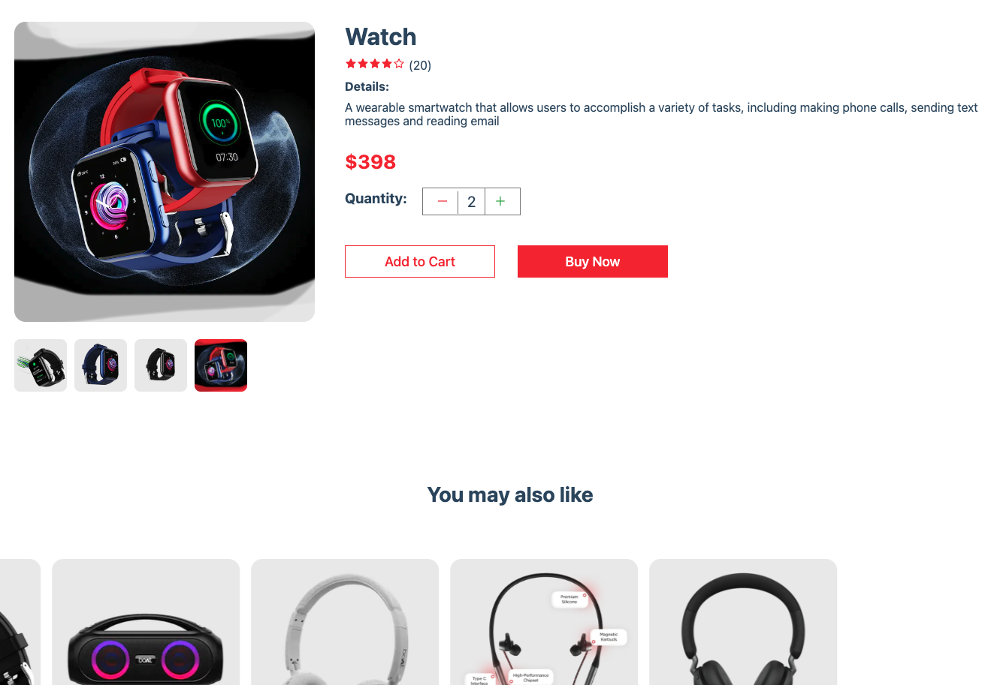
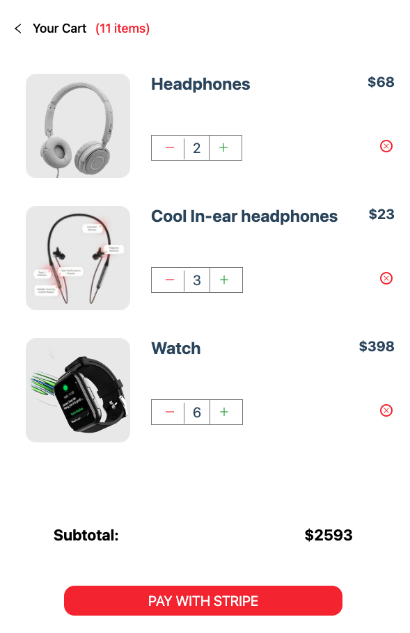

## Introduction
This is a small project about eccomerce demo, I learned something about how to make integration with santiy and configure data in the background. The difficult part for is to make integration, it takes me a lot of time to get the right format. after I solve the problem, I think I should see the documentation more carrfully.

## File Structure
- components: React components that have independent logic.
- context: State management with context API
- lib: integration with santiy, stripe.
- pages: contain 3 page, home(index.tsx), success, product detail page.
## Get started

- Install the dependencies.
npm install --legacy-peer-deps

- Generate Sanity ProjectId, Token and Stripe Publishable key and Secret Key
NEXT_PUBLIC_SANITY_PROJECTID
NEXT_PUBLIC_SANITY_TOKEN
NEXT_PUBLIC_STRIPE_PUBLISHABLE_KEY
NEXT_PUBLIC_STRIPE_SECRET_KEY

- Configure some Santiy
enter the sanity folder, install the dependencies, and run the command `npm run dev`


- Test Credit card for the Stripe
```
Card NO: 4242 4242 4242 4242
Date: 04/24
CVC: 424
```

## screenshots

- Home Page


- Product Detail


- Check Out
